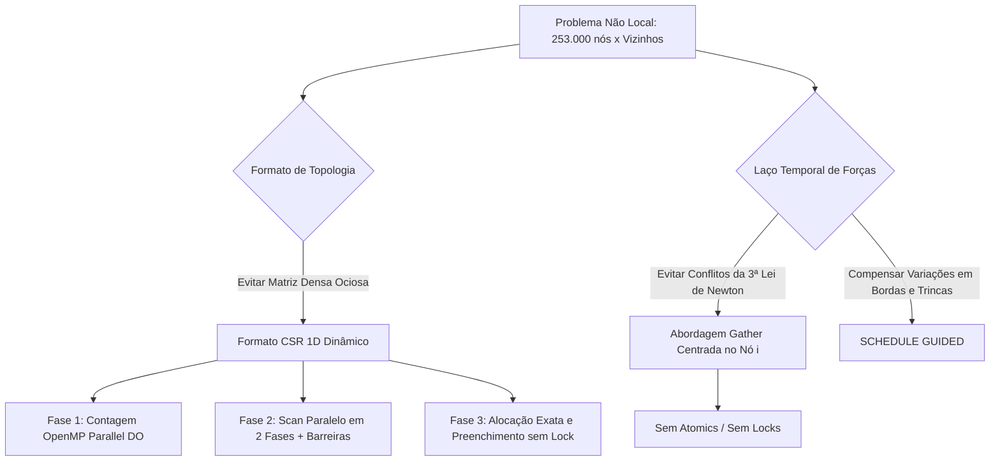

# Estratégias de Paralelização OpenMP no Código Peridinâmico (`openmp_onnode.f90`)

Este documento apresenta uma análise técnica e arquitetural detalhada das estratégias de paralelização em memória compartilhada implementadas com **OpenMP** no programa de simulação peridinâmica bidimensional baseada em vínculos.

## Sumário Executivo

A simulação computacional modela uma placa discretizada com $500 \times 500$ nós na região interna mais camadas de contorno inferior e superior (totalizando $N = 253.000$ pontos materiais). Para cada passo temporal de um total de $N_t = 1.250$, o método peridinâmico calcula interações não locais entre cada ponto e todos os nós vizinhos contidos em uma esfera de raio de horizonte $\delta = 3{,}015\,\Delta x$.

A paralelização adota um paradigma híbrido de alta eficiência:
1. **Representação Compacta de Topologia (CSR Dinâmico)** combinada com um **Algoritmo de Varredura Paralela (*Parallel Prefix Sum / Scan*) em 2 fases** para alocação e indexação exata de vizinhos sem desperdício de memória.
2. **Formulação Centrada no Nó (*Node-Centric Gather Pattern*)** no laço de forças, eliminando condições de corrida (*race conditions*) e a necessidade de diretivas de sincronização atômica (`!$OMP ATOMIC` ou `CRITICAL`).
3. **Balanceamento Dinâmico de Carga** utilizando escalonamento guiado (`SCHEDULE(GUIDED)`) para compensar assimetrias na quantidade de vizinhos causadas por bordas e propagação de trincas.
4. **Instrumentação de Desempenho Integrada** por meio de temporizadores de alta precisão (`omp_get_wtime`).

```
                              FLUXO GERAL DA APLICAÇÃO
  
  [ 1. Pré-Processamento da Topologia ]
    │
    ├─── Fase 1: Contagem de Vizinhos (O(N²)) ────────────► OpenMP Parallel DO
    ├─── Fase 2: Scan Paralelo (Prefix Sum) ──────────────► OpenMP Parallel + Barriers
    └─── Fase 3: Montagem da Lista 'nodefam' (CSR) ───────► OpenMP Parallel DO
    │
  [ 2. Condições Iniciais, Trinca e Calibração de Superfície ]
    │
  [ 3. Laço Temporal Explícito (nt = 1250) ]
    │
    ├─── Condições de Contorno (BC) ──────────────────────► Sequencial (rápido, N_bc << N)
    ├─── Forças Não Locais e Dano ────────────────────────► OpenMP Parallel DO (SCHEDULE GUIDED)
    ├─── Integração Cinemática Explícita ────────────────► Sequencial (vetorial O(N))
    └─── Snapshots I/O (tt = 750, 1000, 1250) ────────────► Sequencial (thread mestre)
    │
  [ 4. Escrita de Métricas de Desempenho (I/O) ]
```

---

## 1. Topologia Dinâmica e Scan Paralelo (CSR)

### 1.1 O Desafio Estrutural
Em peridinâmica, a matriz de adjacência (famílias de nós vizinhos) é esparsa. Se alocada como uma matriz densa bidimensional fixa `nodefam(totnode, maxfam)`:
- Ocorre grande desperdício de memória para nós das bordas que possuem menos vizinhos.
- Há risco de *buffer overflow* se `maxfam` for subdimensionado, ou falha de alocação de heap se for superdimensionado.

A solução adotada é o formato **CSR (*Compressed Sparse Row*)**, composto por:
- `numfam(i)`: Quantidade exata de vizinhos do nó `i`.
- `pointfam(i)`: Ponteiro (índice 1-based) para a posição inicial da família do nó `i` no vetor global contíguo `nodefam`.
- `nodefam(:)`: Vetor 1D plano alocado dinamicamente com tamanho exato $\sum_{i=1}^{N} \text{numfam}(i)$.

---

### 1.2 Fase 1: Contagem Paralela de Vizinhos (`!$OMP PARALLEL DO`)

```fortran
!$OMP PARALLEL DO PRIVATE(j, idist) SHARED(numfam, coord, delta)
do i = 1, totnode
    do j = 1, totnode
        if (i /= j) then
            idist = sqrt((coord(j,1) - coord(i,1))**2 + (coord(j,2) - coord(i,2))**2)
            if (idist <= delta) then
                numfam(i) = numfam(i) + 1
            endif
        endif
    enddo
enddo
!$OMP END PARALLEL DO
```

#### Mecanismos de Concorrência:
- **Divisão de Trabalho**: O laço externo sobre os nós `i = 1 .. totnode` é fatiado entre as threads.
- **Isolamento de Escopo (`PRIVATE`)**:
  - `j`: Índice do nó candidato vizinho; precisa ser estritamente privado para não haver sobrescrita cruzada de laços entre threads.
  - `idist`: Distância euclidiana temporária calculada pela thread.
- **Ausência de Conflito de Escrita**: Cada thread escreve estritamente na posição `numfam(i)`, e cada `i` pertence a uma única iteração atribuída a uma única thread. As coordenadas `coord` e o raio `delta` são exclusivamente de leitura (`SHARED`).

---

### 1.3 Fase 2: Scan Paralelo em 2 Fases (*Parallel Prefix Sum*)

Para determinar o vetor `pointfam`, é necessário calcular a soma prefixada exclusiva de `numfam`:
$$\text{pointfam}(1) = 1, \quad \text{pointfam}(i) = \text{pointfam}(i-1) + \text{numfam}(i-1)$$

Em vez de serializar essa operação para 253.000 nós (o que geraria um gargalo de acordo com a Lei de Amdahl), o código implementa um algoritmo de prefix sum paralelo dividido em blocos por thread:

```fortran
allocate(prefix_offsets(omp_get_max_threads() + 1))
prefix_offsets = 0

!$OMP PARALLEL DEFAULT(SHARED) PRIVATE(i, tid, nthreads, i_start, i_end, my_sum, my_offset)
tid = omp_get_thread_num() 
nthreads = omp_get_num_threads()

! Fatiamento estático manual por thread
i_start = (totnode * tid) / nthreads + 1
i_end   = (totnode * (tid + 1)) / nthreads

! Passo 1: Scan local independente em cada thread
my_sum = 0
do i = i_start, i_end
    pointfam(i) = my_sum
    my_sum = my_sum + numfam(i)
end do 

prefix_offsets(tid + 1) = my_sum
!$OMP BARRIER

! Passo 2: Redução serial dos deslocamentos globais
!$OMP SINGLE
global_accum = 1
do i = 1, nthreads
    my_offset = prefix_offsets(i)   
    prefix_offsets(i) = global_accum 
    global_accum = global_accum + my_offset 
end do 
!$OMP END SINGLE
!$OMP BARRIER  

! Passo 3: Ajuste final dos offsets locais
my_offset = prefix_offsets(tid + 1)
do i = i_start, i_end
    pointfam(i) = pointfam(i) + my_offset
end do
!$OMP END PARALLEL
```

#### Detalhamento das Etapas do Scan:
1. **Passo 1 (Scan Local Privado)**: Cada thread itera sobre seu subintervalo `[i_start, i_end]`, calculando offsets locais relativos a 0 e salvando a soma parcial total de seu bloco em `prefix_offsets(tid + 1)`.
2. **Sincronização 1 (`!$OMP BARRIER`)**: Garante que todas as threads completaram seu scan local e preencheram `prefix_offsets` antes do passo seguinte.
3. **Passo 2 (Acúmulo Global com `!$OMP SINGLE`)**: Uma única thread calcula os offsets base acumulados globais a partir do índice 1 (padrão 1-based do Fortran). Ao término da região `SINGLE`, a barreira implícita garante a consistência para o próximo passo.
4. **Sincronização 2 (`!$OMP BARRIER`)**: Assegura que o array `prefix_offsets` contenha os deslocamentos globais consolidados.
5. **Passo 3 (Uniformização Vetorial)**: Cada thread adiciona seu `my_offset` global aos seus respectivos elementos em `pointfam`.

---

### 1.4 Fase 3: Preenchimento Concorrente de `nodefam`

Com as posições de início (`pointfam`) perfeitamente conhecidas e disjuntas, a alocação é dimensionada de forma exata:

```fortran
total_family_size = pointfam(totnode) + numfam(totnode) - 1
allocate(nodefam(total_family_size))
```

E o preenchimento ocorre sem qualquer bloqueio:

```fortran
!$OMP PARALLEL DO PRIVATE(j, idist, kount) SHARED(pointfam, nodefam, coord, delta)
do i = 1, totnode
    kount = 0
    do j = 1, totnode
        if (i /= j) then
            idist = sqrt((coord(j,1) - coord(i,1))**2 + (coord(j,2) - coord(i,2))**2)
            if (idist <= delta) then
                nodefam(pointfam(i) + kount) = j
                kount = kount + 1
            endif
        endif
    enddo
enddo
!$OMP END PARALLEL DO
```

> **Garantia de Não Sobreposição:**  
> Como $\text{pointfam}(i+1) = \text{pointfam}(i) + \text{numfam}(i)$, os intervalos de memória gravados por diferentes iterações de `i` em `nodefam` são mutuamente exclusivos. Logo, múltiplas threads escrevem concorrentemente no vetor `nodefam` sem perigo de *race condition* e sem necessidade de semáforos ou seções críticas.

---

## 2. Paralelização do Laço Temporal: Forças e Dano

O laço temporal executa $N_t = 1.250$ passos de integração explícita. A rotina mais custosa computacionalmente é a avaliação das forças elásticas peridinâmicas e o estado de quebra de vínculos (*damage/failure*).

```fortran
!$OMP PARALLEL DO DEFAULT(SHARED) &
!$OMP PRIVATE(i, j, dmgpar1, dmgpar2, cnode, idist, nlength, fac, &
!$OMP         theta, scx, scy, scr, dforce1, dforce2) &
!$OMP SCHEDULE(GUIDED)
do i = 1, totnode
    dmgpar1 = 0.0_dp
    dmgpar2 = 0.0_dp
    pforce(i,1) = 0.0_dp
    pforce(i,2) = 0.0_dp

    do j = 1, numfam(i)          
        cnode = nodefam(pointfam(i) + j - 1) 
        idist = sqrt((coord(cnode,1) - coord(i,1))**2 + (coord(cnode,2) - coord(i,2))**2)
        nlength = sqrt((coord(cnode,1) + disp(cnode,1) - coord(i,1) - disp(i,1))**2 + &
                       (coord(cnode,2) + disp(cnode,2) - coord(i,2) - disp(i,2))**2)
        
        ! Correções de volume e superfície...
        ...
        ! Cálculo de dforce1, dforce2 e atualização do estado fail(i,j)...
        pforce(i,1) = pforce(i,1) + dforce1              
        pforce(i,2) = pforce(i,2) + dforce2              
        ...
        dmgpar1 = dmgpar1 + fail(i,j) * vol * fac
        dmgpar2 = dmgpar2 + vol * fac              
    enddo

    if (dmgpar2 > 0.0_dp) then
        dmg(i) = 1.0_dp - dmgpar1 / dmgpar2
    else
        dmg(i) = 0.0_dp
    end if
enddo
!$OMP END PARALLEL DO
```

---

### 2.1 Padrão *Gather* (Coleta Centrada no Nó) vs *Scatter* (Dispersão)

Em códigos seriais de dinâmica molecular e mecânica contínua, é comum explorar a 3ª Lei de Newton:
$$\mathbf{f}_{ji} = -\mathbf{f}_{ij}$$
Isso permite computar apenas metade dos pares. Porém, em ambiente multithread paralelo:
- Atualizar simultaneamente o nó $i$ e o nó $j$ exigiria proteção atômica em $\mathbf{f}(j)$:
  ```fortran
  !$OMP ATOMIC
  pforce(cnode, 1) = pforce(cnode, 1) - dforce1  ! ALTO CUSTO DE CONTENÇÃO!
  ```
  Isso provocaria saturação no barramento de memória devido a constantes conflitos entre núcleos.

#### Solução Implementada no Código:
O código adota o **Padrão Gather Centrado no Nó $i$**:
- O nó $i$ apenas lê os dados de seus vizinhos `cnode` (`coord(cnode, :)`, `disp(cnode, :)`, `fncst(cnode, :)`).
- O nó $i$ acumula forças **exclusivamente no seu próprio vetor local** `pforce(i, :)` e atualiza apenas a sua própria linha em `fail(i, :)`.
- **Resultado:** Zero contenção de memória, independência total entre iterações e escalabilidade linear quase perfeita com o aumento de núcleos físicos.

---

### 2.2 Estratégia de Escalonamento: `SCHEDULE(GUIDED)`

Por que a escolha de `SCHEDULE(GUIDED)` em vez de `STATIC` ou `DYNAMIC`?

| Política | Comportamento | Impacto na Simulação Peridinâmica |
| :--- | :--- | :--- |
| **`STATIC`** | Divide o espaço de iterações em blocos iguais pré-fixados. | **Desbalanceamento de Carga:** Nós nas bordas da malha têm menos de metade dos vizinhos em comparação aos nós internos. As threads com nós de borda terminam cedo e ficam ociosas. |
| **`DYNAMIC`** | Atribui pequenos blocos sob demanda conforme threads ficam livres. | **Overhead Excessivo:** Para $253.000$ nós em $1.250$ passos, o custo de travas e sincronização para consultar a fila de tarefas reduz a performance. |
| **`GUIDED` (Adotada)** | Começa com blocos grandes de iterações e diminui o tamanho exponencialmente conforme as iterações se aproximam do fim. | **Equilíbrio Ótimo:** Reduz drasticamente o overhead inicial de agendamento e absorve variações locais de carga (bordas e regiões onde vínculos falham ao longo do tempo). |

---

### 2.3 Mapeamento Detalhado do Escopo de Variáveis (`Data Sharing Attributes`)

A tabela a seguir documenta o isolamento de cada variável na diretiva OpenMP:

| Variável | Escopo | Papel e Justificativa de Isolamento |
| :--- | :--- | :--- |
| `i` | `PRIVATE` | Índice do laço principal. Cada thread precisa de seu próprio contador de nós. |
| `j` | `PRIVATE` | Contador do laço interno de vizinhos ($1 \dots \text{numfam}(i)$). |
| `cnode` | `PRIVATE` | Identificador do vizinho atual. Deve ser privado para evitar troca de nós entre threads. |
| `idist`, `nlength` | `PRIVATE` | Comprimento inicial e deformado do vínculo entre $i$ e `cnode`. |
| `fac`, `theta` | `PRIVATE` | Fatores geométricos de correção de volume e ângulo de ligação. |
| `scx`, `scy`, `scr`| `PRIVATE` | Parâmetros de correção de superfície (*surface correction*). |
| `dforce1`, `dforce2`| `PRIVATE`| Componentes cartesianas da força diferencial do vínculo. |
| `dmgpar1`, `dmgpar2`| `PRIVATE`| Acumuladores intermediários de dano do ponto $i$. |
| `coord` | `SHARED` (Read-only) | Malha de referência invariante durante os passos de tempo. |
| `disp`, `vel` | `SHARED` (Read-only no loop) | Deslocamentos acumulados; no loop de forças, são apenas lidos. |
| `fncst` | `SHARED` (Read-only) | Constantes de calibração de superfície pré-calculadas. |
| `nodefam`, `pointfam`| `SHARED` (Read-only) | Topologia CSR de vizinhança imutável após a fase de setup. |
| `pforce(i,:)` | `SHARED` (Write-partitioned) | Força acumulada no nó $i$; particionada naturalmente pelo índice $i$. |
| `dmg(i)` | `SHARED` (Write-partitioned) | Valor final do dano acumulado no nó $i$. |
| `fail(i,j)` | `SHARED` (Write-partitioned) | Indicador binário de integridade do vínculo ($1=$ ativo, $0=$ rompido). |

---

## 3. Disposição de Memória e Considerações de Cache (Fortran Layout)

No Fortran, as matrizes seguem **ordem principal por colunas (*column-major order*)**.

### Análise da Matriz `fail(totnode, maxfam)`
- Na declaração: `integer :: fail(totnode, maxfam)`
- No acesso: `fail(i, j)` onde `i` é o nó e `j` varia de $1$ a $\text{numfam}(i)$.
- **Comportamento na Memória:**
  - Elementos adjacentes no mesmo vetor de vizinhos de um nó $i$ (`fail(i, 1)`, `fail(i, 2)`, etc.) estão separados na memória por uma distância de `totnode * sizeof(integer) = 253.000 * 4 bytes ≈ 1 MB`!
  - Isso gera um padrão de acesso com *stride* grande ao iterar sobre $j$.
- **Recomendação de Otimização Futura:**
  - Inverter a declaração para `fail(maxfam, totnode)` ou achatá-la junto com o vetor `nodefam` em um único vetor dinâmico 1D `fail(total_family_size)`. Isso tornaria os vizinhos de um mesmo nó perfeitamente contíguos na memória cache L1/L2, reduzindo falhas de cache (*cache misses*).

---

## 4. Telemetria e Profiling de Performance

O código incorpora medições precisas do tempo de relógio de parede (*wall-clock*) com a função `omp_get_wtime()`. As métricas registradas são salvas diretamente no relatório `familia_resultados_onloading.txt`:

```fortran
write(26, *) "===== RESUMO DE PERFORMANCE (OPENMP CPU) ====="
write(26, '(A, F12.6, A)') "Tempo Total da Topologia (Fase 1+2+3): ", tempo_total_sim_s1, " s"
write(26, '(A, F12.6, A)') "  -> Parte 1 (Contagem):                 ", t_parte1, " s"
write(26, '(A, F12.6, A)') "  -> Parte 2 (Scan/Prefix Sum):          ", t_parte2, " s"
write(26, '(A, F12.6, A)') "  -> Parte 3 (Preenchimento):            ", t_parte3, " s"
write(26, '(A, F12.6, A)') "Tempo das Condicoes (BC):              ", tempo_total_bc_s, " s"
write(26, '(A, F12.6, A)') "Tempo de Forcas/Dano:                  ", tempo_total_forca_s, " s"
write(26, '(A, F12.6, A)') "Tempo de Escrita (I/O):                ", tempo_total_io_s, " s"
write(26, '(A, F12.6, A)') "Tempo Total do Programa (Wall-clock):  ", tempo_wall_clock, " s"
```

Essa granularidade permite mensurar com precisão a fração paralelizável versus serial e aferir o ganho de aceleração (*Speedup* $S = T_1 / T_p$) e a Eficiência Paralela ($E = S / p$).

---

## 5. Guia de Compilação e Execução

### 5.1 Compilação com GNU Fortran (`gfortran`)
```bash
gfortran -O3 -fopenmp -march=native openmp_onnode.f90 -o perid_openmp.exe
```

### 5.2 Compilação com Intel Fortran (`ifx` ou `ifort`)
```bash
ifx -O3 -qopenmp -xHost -fp-model fast openmp_onnode.f90 -o perid_openmp.exe
```

### 5.3 Variáveis de Ambiente Recomendadas para Execução
Para maximizar a afinidade dos núcleos e evitar migração de threads pelo sistema operacional (especialmente em CPUs com arquitetura híbrida ou multiprocessadas NUMA):

```bash
# Definir número de threads (ex: 8 núcleos físicos)
export OMP_NUM_THREADS=8

# Fixar threads em núcleos de hardware específicos (afinidade)
export OMP_PROC_BIND=close
export OMP_PLACES=cores

# Ajustar tamanho de pilha para evitar stack overflow em simulações extensas
export OMP_STACKSIZE=64M
```

---

## 6. Resumo das Decisões de Arquitetura de Concorrência



Esta arquitetura garante que o código execute com máxima eficiência de processamento multithread, eliminando contenções de memória e mantendo a integridade estrita das soluções físicas de fratura e mecânica peridinâmica.


## 7. Próximos Passos e Oportunidades de Otimização

Esta seção serve como guia prático para os próximos desenvolvedores e pesquisadores que darão continuidade à evolução deste projeto. A meta é avançar na maturidade computacional da aplicação.

---

### 7.1 Substituição da Busca de Vizinhos $O(N^2)$ por *Cell Lists* ($O(N)$)

#### Diagnóstico Atual:
Nas **Fases 1 e 3** do pré-processamento da topologia, o algoritmo executa dois laços aninhados sobre `totnode`:
$$\text{Custo de Comparações} = N \times N = 253.000 \times 253.000 \approx 6{,}4 \times 10^{10} \text{ pares}$$
Embora distribuído entre as threads com `!$OMP PARALLEL DO`, esse custo quadrático inviabiliza simulações com malhas mais refinadas ($N > 10^6$) e torna a inicialização lenta.

#### Proposta de Implementação (*Linked-Cell / Grid Binning*):
1. **Discretização do Domínio em Células:**
   - Particionar o domínio bidimensional em uma grade de células regulares de tamanho $L_{\text{cell}} \ge \delta$ (raio do horizonte).
   - O índice da célula de qualquer nó $(x_i, y_i)$ é obtido em $O(1)$:
     $$c_x = \left\lfloor \frac{x_i - x_{\min}}{L_{\text{cell}}} \right\rfloor + 1, \quad c_y = \left\lfloor \frac{y_i - y_{\min}}{L_{\text{cell}}} \right\rfloor + 1$$
2. **Restrição da Busca de Vizinhança:**
   - Em vez de comparar o nó $i$ com todos os nós do domínio, basta inspecionar a célula à qual o nó pertence e as suas **8 células vizinhas imediatas** (em 2D).
   - O número de candidatos a vizinho reduz-se de $253.000$ para um número finito e pequeno ($\approx 30$ a $50$ nós), tornando o tempo de montagem estritamente linear:
     $$\text{Complexidade}: O(N^2) \longrightarrow O(N)$$
3. **Integração com o Pipeline Existente:**
   - A lógica das Fases 2 (Scan Paralelo) e 3 (Construção CSR) pode ser mantida integralmente, alterando-se apenas a rotina de busca de candidatos que alimenta `numfam` e `nodefam`.

---

### 7.2 Paralelização das Etapas de Contorno e Integração Cinemática

Atualmente, o miolo do laço temporal (`tt = 1 .. nt`) alterna entre trechos paralelos e trechos seriais. Recomenda-se estender a cobertura OpenMP para as etapas restantes:

Seria interessante ver quais outras partes poderiam ser paralelizadas e se realmente vale a pena paralelizar elas. 


### 7.3 Checklist para Próximos Desenvolvedores

- [ ] Implementar módulo de binning espacial (*Cell List*) e medir redução de tempo nas Fases 1 e 3.
- [ ] Aplicar paralelismo nos laços de Condição de Contorno e Cinemática Explícita.
- [ ] Refatorar a matriz `fail` para layout contíguo unidimensional CSR (`fail(total_family_size)`).
- [ ] Rodar bateria de benchmarks ($1 \dots p_{\max}$ threads) e plotar curvas de Speedup e Eficiência.
- [ ] Executar análise de contenção de cache no Intel VTune ou `perf c2c` para atestar a ausência de *False Sharing*.
- [ ] *(Fase Futura)* Avaliar diretivas de offloading para GPU (`!$OMP TARGET`) ou particionamento de domínio com MPI para execução em múltiplos nós de cluster.
